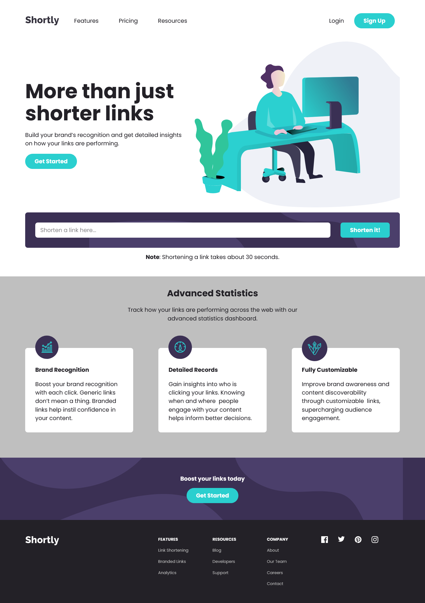

# Frontend Mentor - Shortly URL shortening API Challenge solution

This is a solution to the [Shortly URL shortening API Challenge challenge on Frontend Mentor](https://www.frontendmentor.io/challenges/url-shortening-api-landing-page-2ce3ob-G). Frontend Mentor challenges help you improve your coding skills by building realistic projects.

## Overview

### The challenge

Users should be able to:

- View the optimal layout for the site depending on their device's screen size
- Shorten any valid URL
- See a list of their shortened links, even after refreshing the browser
- Copy the shortened link to their clipboard in a single click
- Receive an error message when the `form` is submitted if:
  - The `input` field is empty

### Screenshot

### Links

- Solution URL: [https://www.frontendmentor.io/solutions/create-react-app-with-jsx-and-styledcomponents-XcB1omTLf](https://www.frontendmentor.io/solutions/create-react-app-with-jsx-and-styledcomponents-XcB1omTLf)
- Live Site URL: [https://shamwela-shortly.netlify.app](https://shamwela-shortly.netlify.app)

## My process

### Built with

Create React App (with JSX)

styled-components

### What I learned

How to Use Fetch with async/await

### Useful resources

- [Dmitri Pavlutin](https://dmitripavlutin.com/javascript-fetch-async-await/) - This helped me understand JavaScript Fetch with async/await

## Author

- Website - [shamwela.com](https://shamwela.com)
- Frontend Mentor - [@shamwela](https://www.frontendmentor.io/profile/shamwela)
- Twitter - [@shamwela\_](https://twitter.com/shamwela_)
